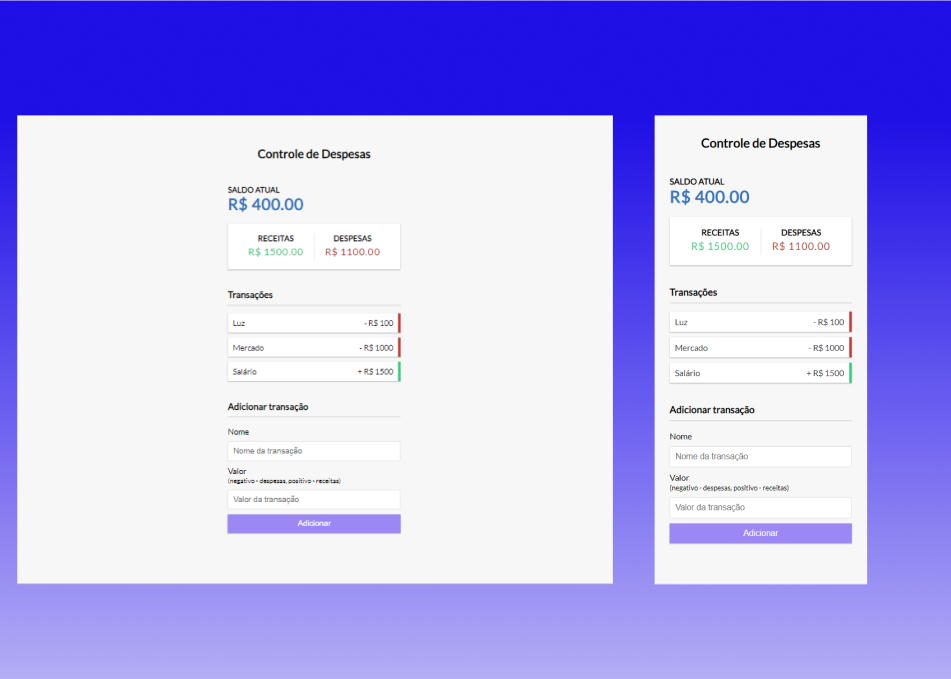

# Controle Financeiro

Este é um projeto de Controle Financeiro desenvolvido com HTML, CSS e JavaScript. Ele oferece uma interface intuitiva para acompanhar suas finanças pessoais.

.

# Recursos Principais:
- Voce pode adicionar transações com descrição, ter um controle de entrada e saídas e ter um controle do saldo atual.
- Adição de despesas e receitas.
- Cálculo automático do saldo.
- Exibição de histórico de transações.
  
Gráficos visuais para análise financeira
# Tecnologias utilizadas
• HTML  
• CSS  
• Javascript

# Armazenamento
Utiliza armazenamento local, mantendo os dados mesmo após o fechamento da aba/navegador.

# Como utilizar
Pode ser utlizado de duas formas:  
• Clonando o repositorio e executando em localhost.  
• Acessando o site: [Link](https://caiomafia.github.io/Controle-financeiro/)
